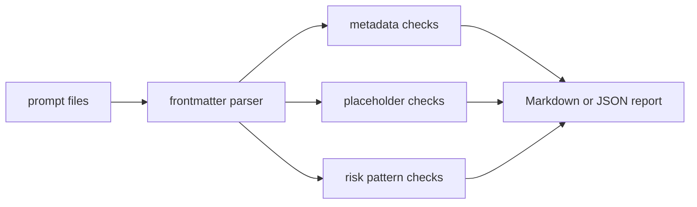

# prompt-pack-lint

`prompt-pack-lint` checks reusable prompt files before they reach an LLM application. It
looks for missing ownership metadata, placeholder mistakes, stale variables, and risky
instruction patterns that tend to hide inside copied prompts.

## Why it is useful

Prompt packs become production assets once they are versioned, reviewed, and reused. This
CLI gives teams a small deterministic gate for pull requests, CI jobs, and local reviews
without sending prompt content to a remote service.

## Key features

- scans `.md`, `.txt`, and `.prompt` files
- parses lightweight frontmatter metadata
- detects undeclared and unused `{placeholders}`
- flags unsafe wording such as instruction overrides and secret exposure requests
- emits Markdown or JSON reports
- exits non-zero when issues meet a configurable severity threshold

## Installation

```bash
python -m pip install -e ".[dev]"
```

## Usage

```bash
prompt-pack-lint scan examples/prompts
prompt-pack-lint scan examples/prompts --format json
prompt-pack-lint scan prompts/ --fail-on medium
python -m prompt_pack_lint --help
```

Prompt files can use frontmatter like this:

```markdown
---
owner: ai-platform
version: 1
purpose: summarize support tickets
variables: [ticket_text, customer_tier]
---

Summarize {ticket_text} for {customer_tier}.
Follow policy and refuse unsafe requests.
```

## Workflow



## Tests

```bash
ruff check .
pytest
python -m prompt_pack_lint --help
```

## License

MIT

