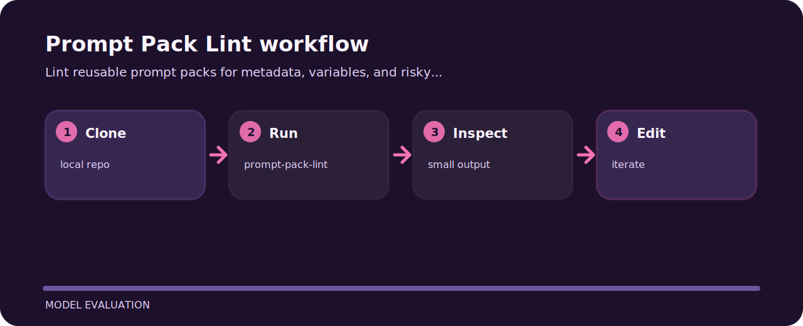

# Prompt Pack Lint

Lint reusable prompt packs for metadata, variables, and risky instruction patterns.


## Code trail

```text
.github/        CI workflow
examples/       sample inputs
src/            package source
tests/          test coverage
.gitignore      project file
```

## Shape of the tool



## Try the sample

```bash
git clone https://github.com/mertefekurt/prompt-pack-lint.git
cd prompt-pack-lint
python -m pip install -e ".[dev]"
prompt-pack-lint --help
```

## Useful details

- Designed as a focused model evaluation repo.
- Keeps setup short.
- Prioritizes readable output over infrastructure.
